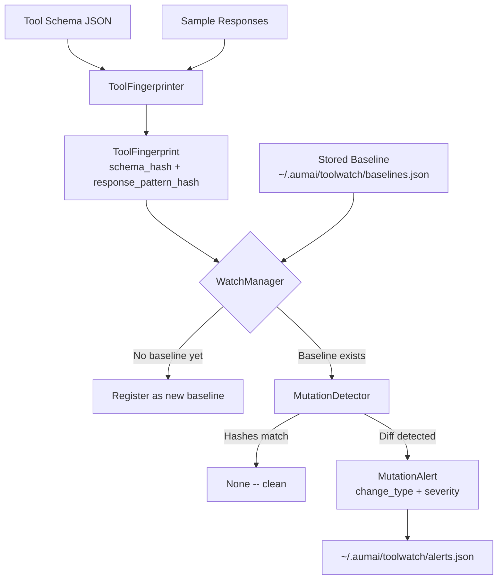

# aumai-toolwatch

**Detect runtime changes in tool behavior.**

Monitor tool schemas and response patterns for schema drift, behavioral mutations, and silent breaking changes — before they corrupt your agents.

[](https://pypi.org/project/aumai-toolwatch/)
[](https://www.python.org/)
[](LICENSE)
[](https://github.com/aumai)

---

## What is this?

Imagine you have a set of employees (AI agents) who rely on a shared handbook (tool definitions) to do their jobs. One day someone quietly rewrites a chapter. The employees don't know — the handbook looks the same on the outside — but now their work produces wrong results.

`aumai-toolwatch` is an automated auditor that reads that handbook at regular intervals, computes a cryptographic fingerprint of its contents, and raises an alarm the moment anything changes. It works at two levels:

1. **Schema fingerprinting** — the tool's declared input/output structure (JSON Schema) is hashed. Any field addition, removal, type change, or constraint change triggers an alert.
2. **Response-pattern fingerprinting** — a sample of actual tool responses is summarized structurally (which keys appear and what types they hold) and hashed. Silent behavioral drift — a tool that starts returning extra fields or changes a value's type — is caught even when the declared schema is unchanged.

Think of it as a smoke detector for your tool layer: silent until something goes wrong, then immediately loud.

---

## Why does this matter?

AI agents interact with tools through a contract: "call this function with these parameters, get back data shaped like this." Modern agentic systems can involve dozens of third-party tools, internal microservices, and external APIs. Any of these can change without warning:

- A vendor updates their API and the response structure changes silently.
- A team member refactors an internal tool and accidentally renames a key.
- An LLM-backed tool changes its output format because the underlying model was updated.

Without monitoring, these mutations cause silent failures: agents that produce wrong answers, hallucinate compensations for missing fields, or — worst of all — continue operating with corrupted data with no indication anything is wrong.

`aumai-toolwatch` applies the same principle database administrators use with schema migration checks and security teams use with file integrity monitoring: **capture a known-good state, compare every future state against it, and alert on any delta.**

---

## Architecture



---

## Features

| Feature | Description |
|---|---|
| **Schema fingerprinting** | SHA-256 hash of a canonically serialized JSON Schema. Stable across field ordering differences. |
| **Response-pattern fingerprinting** | Structural summarization of sample responses — tracks which keys appear and what Python types they hold, without hashing specific values. |
| **Mutation detection** | Three distinct change types: `schema_change`, `response_change`, and `behavior_change` (when both dimensions change simultaneously). |
| **Severity grading** | `medium` for single-dimension changes, `high` when both schema and response patterns change at once. |
| **Persistent baselines** | Baseline fingerprints stored to `~/.aumai/toolwatch/baselines.json` and survive process restarts. |
| **Alert history** | All detected mutations are appended to `~/.aumai/toolwatch/alerts.json`. |
| **CLI** | `baseline`, `check`, and `alerts` commands for use in CI pipelines or cron jobs. |
| **Python API** | Clean class-based API for embedding in agent frameworks. |
| **Minimal dependencies** | Requires only `pydantic` and `click`. No network calls, no database. |

---

## Quick Start

### Install

```bash
pip install aumai-toolwatch
```

### Capture a baseline

Save your tool's JSON schema to a file:

```json
{
  "name": "get_weather",
  "parameters": {
    "type": "object",
    "properties": {
      "location": {"type": "string"},
      "unit": {"type": "string", "enum": ["celsius", "fahrenheit"]}
    },
    "required": ["location"]
  }
}
```

Capture the baseline fingerprint:

```bash
toolwatch baseline \
  --tool get_weather \
  --schema weather_tool_schema.json \
  --version 1.0.0
```

Output:

```json
{
  "tool_name": "get_weather",
  "schema_hash": "a3f8c2d4e9f1b7a3...",
  "response_pattern_hash": "0000000000000000...",
  "captured_at": "2026-02-27T12:00:00+00:00"
}
```

### Check for mutations

Later — in CI, in a cron job, or after a deployment — run:

```bash
toolwatch check \
  --tool get_weather \
  --schema weather_tool_schema.json
```

If nothing changed:

```
No mutation detected for tool 'get_weather'.
```

If a mutation is detected:

```json
{
  "tool_name": "get_weather",
  "change_type": "schema_change",
  "severity": "medium",
  "detected_at": "2026-02-27T14:30:00+00:00"
}
```

### Review all alerts

```bash
toolwatch alerts
```

---

## CLI Reference

All commands are under the `toolwatch` entry point.

### `toolwatch baseline`

Capture and store a baseline fingerprint for a tool.

| Option | Required | Default | Description |
|---|---|---|---|
| `--tool NAME` | Yes | — | Unique tool identifier |
| `--schema PATH` | Yes | — | Path to a JSON file containing the tool schema |
| `--version STRING` | No | `unknown` | Version label for this baseline |

**Example:**

```bash
toolwatch baseline --tool search_tool --schema ./schemas/search.json --version 2.1.0
```

**Output:** JSON object with `tool_name`, `schema_hash`, `response_pattern_hash`, and `captured_at`.

---

### `toolwatch check`

Compare the current schema against the stored baseline and report any mutations.

| Option | Required | Default | Description |
|---|---|---|---|
| `--tool NAME` | Yes | — | Tool to check |
| `--schema PATH` | Yes | — | Path to the current tool schema JSON file |
| `--version STRING` | No | `unknown` | Version label for the current state |

**Example:**

```bash
toolwatch check --tool search_tool --schema ./schemas/search.json
```

**Behavior when no baseline exists:** The current fingerprint is automatically registered as the new baseline and no alert is emitted. This makes `check` safe to run idempotently in a fresh environment.

---

### `toolwatch alerts`

List all recorded mutation alerts from `~/.aumai/toolwatch/alerts.json` in JSON format.
Prints `No alerts recorded.` when the file is absent or empty.

**Example:**

```bash
# Show only high-severity alerts
toolwatch alerts | python3 -c "
import json, sys
alerts = json.load(sys.stdin)
for a in alerts:
    if a['severity'] == 'high':
        print(a['tool_name'], a['change_type'])
"
```

---

## Python API

### Basic usage

```python
from aumai_toolwatch import ToolFingerprinter, WatchManager

fingerprinter = ToolFingerprinter()
manager = WatchManager()

schema = {
    "name": "get_weather",
    "parameters": {
        "properties": {"location": {"type": "string"}},
        "required": ["location"]
    }
}

# Step 1: capture baseline
baseline_fp = fingerprinter.fingerprint(
    tool_name="get_weather",
    schema=schema,
    sample_responses=[{"temperature": 22, "unit": "celsius"}],
    version="1.0.0",
)
manager.add_baseline(baseline_fp)

# Step 2: later, check current state
current_fp = fingerprinter.fingerprint(
    tool_name="get_weather",
    schema=schema,
    sample_responses=[{"temperature": 22, "unit": "celsius"}],
    version="1.0.0",
)

alert = manager.check("get_weather", current_fp)
if alert:
    print(f"Mutation detected: {alert.change_type} (severity: {alert.severity})")
else:
    print("No changes detected.")
```

### Detecting mutations directly

Use `MutationDetector` when you already have two fingerprints and want to compare them without the registry overhead:

```python
from aumai_toolwatch import MutationDetector, ToolFingerprinter

fingerprinter = ToolFingerprinter()
detector = MutationDetector()

old_fp = fingerprinter.fingerprint("my_tool", old_schema, old_samples)
new_fp = fingerprinter.fingerprint("my_tool", new_schema, new_samples)

alert = detector.detect_mutation(old_fp, new_fp)
if alert:
    print(f"Change type: {alert.change_type}")
    print(f"Severity: {alert.severity}")
```

### Reviewing accumulated alerts

```python
alerts = manager.get_alerts()
for alert in alerts:
    print(f"{alert.tool_name}: {alert.change_type} at {alert.detected_at}")

# Retrieve all registered baselines
baselines = manager.get_all_baselines()
for fp in baselines:
    print(f"{fp.tool_name} v{fp.version} captured at {fp.captured_at}")
```

---

## Configuration

The `WatchConfig` model describes monitoring parameters for external schedulers:

```python
from aumai_toolwatch.models import WatchConfig

config = WatchConfig(
    tools=["get_weather", "search_tool", "code_executor"],
    check_interval_seconds=300,      # re-fingerprint every 5 minutes
    alert_on=["schema_change", "behavior_change", "response_change"],
)
```

| Field | Type | Default | Description |
|---|---|---|---|
| `tools` | `list[str]` | `[]` | Tool names to monitor |
| `check_interval_seconds` | `int` | `300` | Re-fingerprint interval in seconds |
| `alert_on` | `list[str]` | all three types | Which change types generate alerts |

`WatchConfig` is a pure data model. The `WatchManager` and `MutationDetector` classes operate independently of it.

---

## How it works — technical deep-dive

### Schema hashing

`ToolFingerprinter.fingerprint()` serializes the schema dict using `json.dumps(sort_keys=True, default=str)` before hashing. This canonical form ensures that two dicts with the same key-value pairs but different insertion order produce the same hash. The algorithm is SHA-256, hex-encoded.

### Response-pattern summarization

Rather than hashing actual response values (which change on every call), the fingerprinter computes a structural signature. For each response in the sample set, it collects the set of `(key, type(value).__name__)` tuples across all top-level keys. The union of these across all samples is then sorted and JSON-serialized, producing a stable string that is SHA-256 hashed.

This design means:
- A tool that starts returning a new key fires an alert.
- A tool that changes a value's type (e.g., `int` to `str`) fires an alert.
- A tool returning different numeric values for the same keys does NOT fire an alert.

### Severity mapping

| Dimensions changed | Severity |
|---|---|
| Schema hash changed only | `medium` |
| Response pattern hash changed only | `medium` |
| Both changed | `high` |

The mapping is defined in `_SEVERITY_MAP` in `core.py` as `{0: "low", 1: "medium", 2: "high"}` where the key is the count of changed dimensions.

### State persistence (CLI)

The CLI uses `~/.aumai/toolwatch/` as its state directory:
- `baselines.json` — JSON array of `ToolFingerprint` objects, rewritten on every `baseline` or `check` command.
- `alerts.json` — Accumulated alert history. New alerts are appended; existing entries are never deleted.

---

## Integration with other AumAI projects

| Project | How they work together |
|---|---|
| `aumai-toolsanitizer` | Sanitize tool metadata before fingerprinting to prevent PII from being captured in hashes or stored baselines. |
| `aumai-toolregistry` | Register tool schemas centrally; use toolwatch to monitor each registered tool's schema for drift. |
| `aumai-transactions` | Wrap baseline-capture and check operations in a transaction for atomic multi-tool audit checkpoints. |

---

## Contributing

See [CONTRIBUTING.md](CONTRIBUTING.md). Bug reports, feature requests, and pull requests are all welcome.

```bash
git clone https://github.com/aumai/aumai-toolwatch
cd aumai-toolwatch
pip install -e ".[dev]"
pytest
```

---

## License

Apache 2.0 — see [LICENSE](LICENSE).
